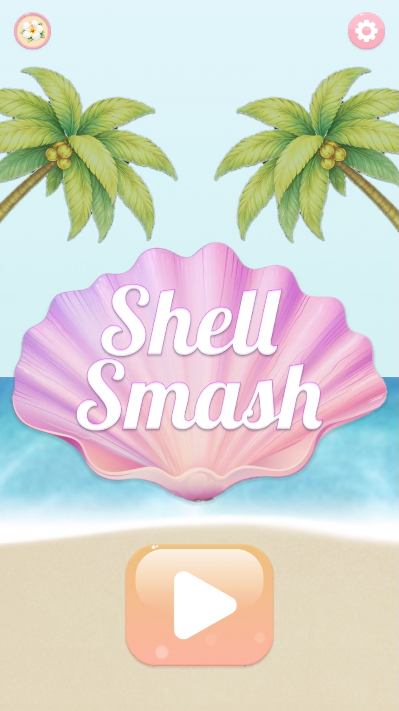
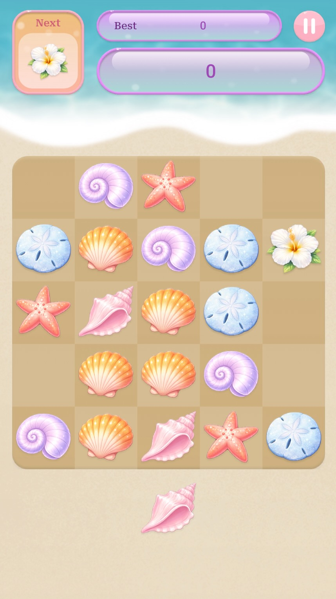
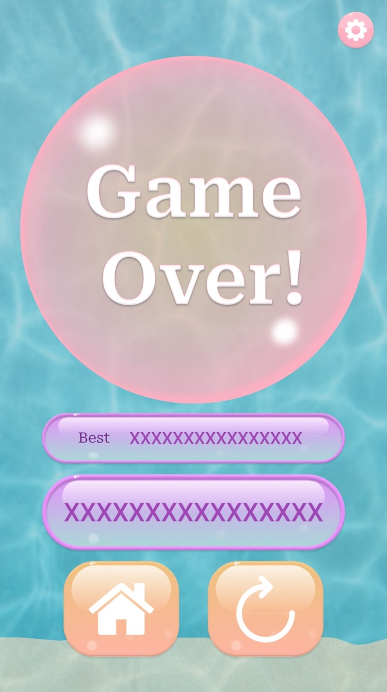
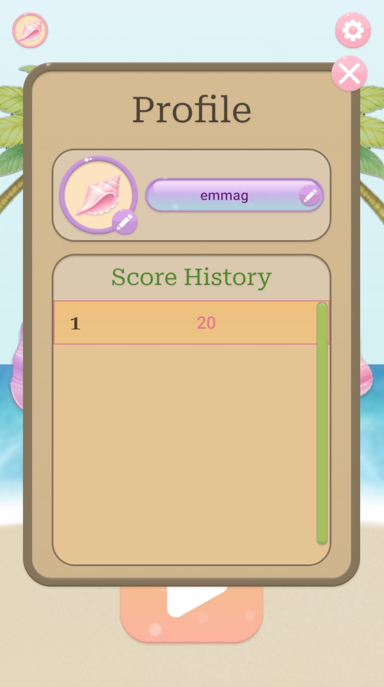
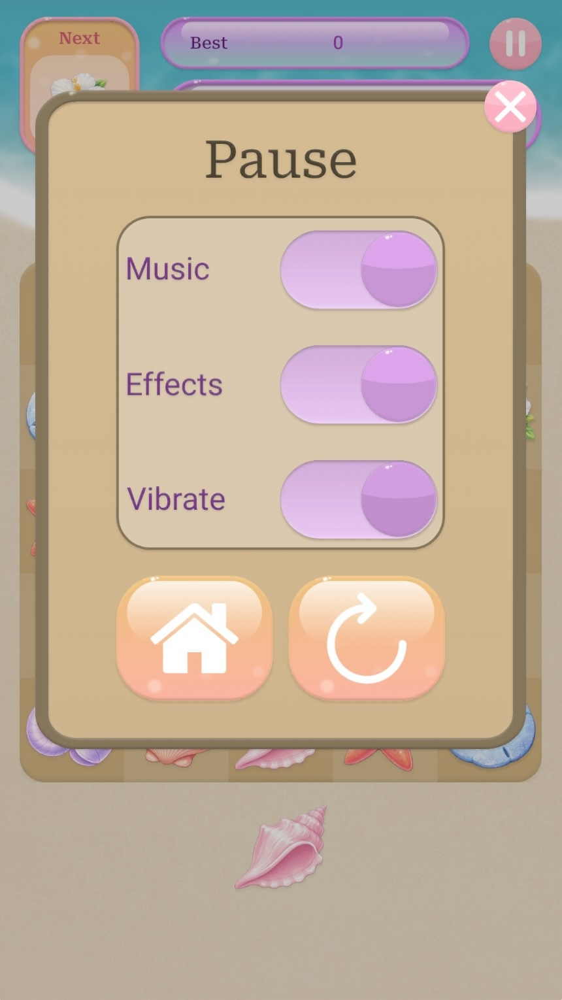
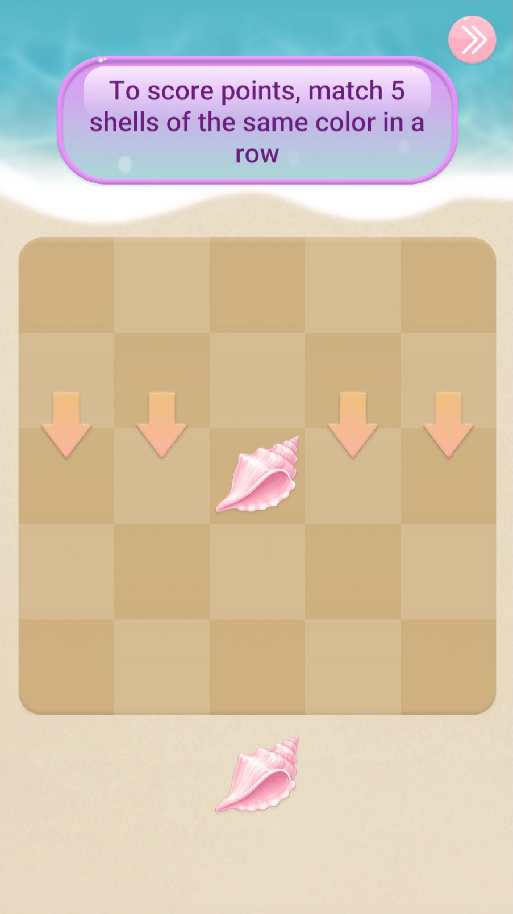

# MG1: Shell Smash

Match, place, and clear the tide of colorful pastel shells before your beach fills up! A laid back,
beach themed puzzle game.

## Screenshots
 
| Home | Gameplay | Game Over |
|------|----------|-----------|
|  |  | |
 
| Profile | Pause | Tutorial |
|---------|----------|----------|
|  |  |  |

## Demo Video
 

 ## Overview

 Shell Smash is a mobile puzzle game built around a 5x5 beach themed board. Each turn you're
 given a single colorful pastel shell piece and drag it onto an open cell on the board. Filling an 
 entire row, column, or diagonal with matching shell colors clears that line and scores points.
 Clearing multiple lines with a single placement multiplies the score. The board persists between 
 turns (nothing clears automatically), so the puzzle is about placing pieces to set up and complete
 lines before the board fills. The game ends when no cells remain open.

 Think **Bejeweled meets Block Blast**: the satisfaction of matching and clearing lines, with the 
 deliberate, one-at-a-time placement of a block drop puzzle. 

 Two special piece types add variety to the color draw:
 - **Mask** pieces can be placed on any cell, including ones that are already filled, and act as
a wildcard when checking whether a line's colors match.
 - **Wildcard** pieces are placed like a normal piece but adopt the color needed to complete
whatever line they land in.

## Core Loop

1. A new piece spawns in a color chosen at random from the game's color set (including the two
special types above).
2. Drag the piece onto the 5x5 board. A ghost preview shows where it will land and whether the cell
is a legal placement.
3. Release to place it. If the placement completes a row, column, or either diagonal, that line
clears and points are awarded.
4. The next piece spawns and the loop repeats until the board fills completely, ending the run.

## Features

- **Profile** - custom username (validated against a profanity filter) and a selectable avatar based on the shell player pieces, cycled through an avatar picker.
- **Score history** - past run scores are saved and browsable from the profile screen.
- **Persistent save/load** - in-progress board state, score, and profile data are saved locally so a session can resume where it left off.
- **Settings** - independent music, sound effect, and vibration toggles, accessible from both the pause menu and a dedicated settings screen.
- **Tutorial** - a guided onboarding flow that walks through placements on a restricted "live zone" of the board before handing over full control.
- **Pause / restart** - pause mid-run, or restart with a confirmation prompt.

## Built With

- Unity 6000.3+
- [EGLib](../EGLib) - a reusable Core/Mechanics/UI library extracted from this project (object pooling, service locator, and generic view navigation system, scroll lists, etc.) and added back in a package.
- TextMeshPro
- Unity Input System
- A third party profanity filtering plugin for username validation

## Architecture

MG1 is organized by feature (Board, Piece, UI, Tutorial, Core) with the Domain/Application/Presentation split applied within each feature folder. A Bootstrap sequence wires up core services (audio, vibration, save storage, service locator, object pooling) behind a loading screen before gameplay starts. Board logic is implemented as plain C# (`BoardLogic`) separate from the MonoBehaviour view layer (`Board`) enforced via assembly definitions, so the rules can be tested independently of Unity.

## Testing

Core board logic (placement validity, line clearing across rows/columns/both diagonals, combo scoring, and game over detection) is covered by an NUnit test suite ('BoardLogicTests`) that runs alongst the plain C# `BoardLogic` class in isolation from Unity, MonoBehaviours, or the view layer.

## Requirements / Platform

- Builds for both iOS and Android
- Formatted for mobile devices only
- Published to TestFlight

## Project Background

This was a solo project build to learn Unity end to end: following a project from start to finish, understanding the game engine and the game loop, and practicing production quality code habits (layered architecture, error-handling discipline, save/load robustness, git commits, and a reusable library extracted along the way, see [EGLib](../EGLib)).

Sparkle Shell Smash is not currently planned for publication. If it were released, it would be monetized with an ad banner and a full-screen ad at game over.

## Credits

- **Art** - all UI elements, backgrounds, and game visuals were made by me, with two exceptions: the shell piece images and the palm tree on the home screen background are AI-generated.
- **Sound effects & music** - sourced from [Pixabay](https://pixabay.com), used under the [Pixabay Content License](https://pixabay.com/service/license-summary/).
- **Font** - Roboto (Google Fonts).
- **Profanity filter** - third party plugin, MIT license.
